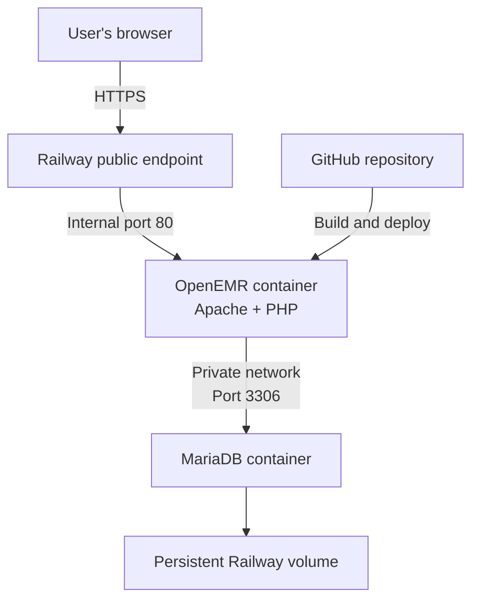

# Executive Summary

[Write this last, approximately 500 words]

# Audit Scope

- Repository: https://github.com/joshuatagoe/openemr-base-clean
- Branch: main
- Commit SHA: 63d65cc7f8486361fb0ac2e895fddd8cfaacb7e6
- Local URL: http://localhost:8300/ 
- Public Railway URL: https://openemr-base-clean-production.up.railway.app/
- OpenEMR version: 8.2.0-dev
- MariaDB version: 11.8.8
- Audit start date: 2026-09-15
- Auditor: Joshua Tagoe

# Architecture Audit

## System Overview

### Current Deployment Architecture

The user's browser connects to OpenEMR through Railway's public HTTPS
endpoint. Railway forwards requests to port 80 inside the OpenEMR
container. OpenEMR communicates with MariaDB through Railway's private
network. MariaDB stores its files in a persistent volume. Railway builds
the OpenEMR container from the GitHub repository.

## Runtime Services

| Component | Location | Public? | Purpose | Persistence |
|---|---|---:|---|---|
| Railway edge | Railway | Yes | Receives HTTPS traffic | N/A |
| OpenEMR | Railway container | Yes | Main PHP application | Investigate |
| MariaDB | Railway service | No | Stores clinical and user data | Persistent volume |
| GitHub | External | Repository only | Stores source code | Git history |
| Railway logs | Railway | Restricted | Application/deployment logs | Check retention |

## Local vs. Railway

[Comparison table]

## Data Stores

[Data inventory table]

## Important Request Flows

[Login, patient search, and dashboard flows]

## Trust Boundaries

[Where data crosses between systems]

## Agent Integration Options

[Possible ways to connect the future agent]

## Architecture Findings

[Verified problems and risks]
