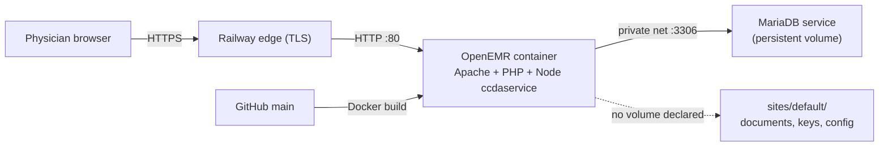
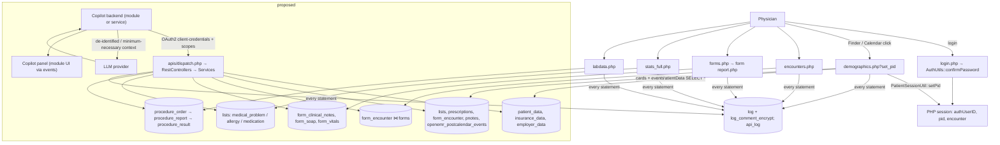

# OpenEMR Clinical Co-Pilot Audit

## Executive Summary

This audit examined the OpenEMR 8.2.0-dev fork at commit `6933fda` that will host a Clinical Co-Pilot: a conversational assistant that, in the 90 seconds between patients, identifies the selected patient, explains the reason for the visit, summarizes what changed, and surfaces notes, problems, medications, allergies, labs and vitals. Scope was the copilot's data path only — authenticated physician → patient and appointment selection → Patient Summary → encounters and notes → problems, medications, allergies, labs, vitals → proposed copilot backend → LLM provider → physician-facing response. Evidence came from static review, read-only aggregate queries on the local development database, read-only dependency audits, and timing measurements against the local Docker container. Nothing was executed against the public Railway deployment.

**The system as found.** OpenEMR is a PHP monolith on one MariaDB database with two coexisting architectures. Every clinical page on the path (`demographics.php`, `encounters.php`, `stats_full.php`, `labdata.php`, per-form `report.php`) is legacy code with inline SQL; the modern `src/Services` and REST/FHIR layers cover the same data and are the right integration surface. Patient context is server-side session state set by a `set_pid` parameter. Authorization is role-based phpGACL enforced page by page, with no patient-level check. Audit logging is on by default and records every SQL statement.

**Most consequential findings.**

1. `demographics.php` reads the full `patient_data` row, runs the decision-rules scan, writes `recent_patients`, and emits the patient's name and DOB into the HTML `<head>` **before** the ACL check at line 1056 (SEC-001, Confirmed).
2. One Patient Summary load issues 163 audited SQL statements, 112 of them uncached phpGACL lookups, each also written to two audit tables (PERF-001/002, Confirmed by measurement). The copilot must not call or imitate the legacy pages.
3. Audit logs hold SQL with bound values as base64, not encryption; the API log stores full response bodies by default. Both are PHI stores the copilot would enlarge (SEC-003, COMP-001, Confirmed).
4. Clinical data is fragmented: medications live in both `lists` and `prescriptions`; all sampled allergies and half of sampled problems are uncoded; "no known allergies" has no representation; vitals default to `0.00` (DATA-001–006). FHIR services reconcile some of this and should be the copilot's source.
5. Twig autoescaping is disabled globally, so model output rendered through a new template is unescaped unless the author adds `|text` (SEC-005, Confirmed).
6. Whether PHI may go to an LLM provider is an organizational question with no repository evidence: no BAA, retention or training settings, or data-flow record (COMP-004, Organizational verification required).

**Is integration advisable now?** Prototyping with **synthetic data** through the OAuth2-protected REST/FHIR API is advisable once ARCH-006 (site-data durability on Railway) and SEC-007 (production configuration) are verified. **Sending PHI to any LLM provider is not advisable** until the Section 7 conditions are met: executed BAA, provider retention and training controls, a dedicated copilot identity, minimum-necessary field scoping, and per-request audit attribution. Production additionally needs SEC-001 fixed or bypassed, ACL caching or a service-layer read path (PERF-001), and a log-retention decision.

**Limitations.** The local sample database holds 6 patients and no encounters, labs or vitals, so data-quality checks rest on schema and code with small-sample confirmation. Timings were taken with Xdebug enabled on Windows Docker bind mounts and are upper bounds. Railway runtime configuration could not be inspected. This is a technical evidence review; it makes no HIPAA compliance determination.

**Remediation order.** Verify Railway durability and configuration → fix or bypass the pre-ACL PHI emission → build a service-layer read path with ACL caching → define minimum-necessary fields and normalization rules → resolve provider contractual questions → only then route PHI.

## Findings at a Glance

Thirty-four findings follow in Sections 3–7, each with severity, verification status, evidence and recommendation. This index groups them by what they mean for a copilot on the audited data path, so a reader can go straight to the ones that constrain the design. Findings are unchanged from the audit as conducted; how the design responded to them is recorded in [ARCHITECTURE.md](ARCHITECTURE.md), not here.

**Constrain the copilot's design** — read these first.

| ID | One line | Consequence for a copilot |
|---|---|---|
| ARCH-001 | Clinical pages are legacy inline SQL; a parallel service layer exists | Do not call or scrape legacy pages; read through the audited data layer |
| ARCH-002 | Patient context is mutable session state set by a query parameter | Bind every request and response to a patient identifier and verify it on both ends |
| ARCH-004 | Events and the local API bridge are the only sanctioned hooks | Build as a custom module; UI via render events, endpoints via `RestApiCreateEvent` |
| ARCH-005 | No scheduler; background work rides on UI traffic | Nothing expensive at bootstrap or render time; compute on demand |
| SEC-001 | `demographics.php` emits PHI before its ACL check | The copilot path must not depend on that page's data path |
| SEC-002 | Authorization is role-only; no patient-level check | Add a care-relationship check server-side, fail closed, audited |
| SEC-005 | Twig autoescaping is off | Render model output as text nodes only |
| PERF-001, PERF-003 | 112 uncached ACL queries per summary load; legacy pages already exceed the latency budget | Memoize ACL checks per request; never wait on the summary page |
| PERF-006 | No timeout, retry, cancellation or degraded mode exists for an LLM dependency | Design all four in from the start |
| DATA-001, DATA-003 | Medications live in two tables with ambiguous active status | Keep both sources with provenance; surface disagreement, never resolve it silently |
| DATA-002, DATA-004, DATA-005, DATA-007 | Uncoded allergies and problems; duplicate rows; empty-string units and free-text result status; free-text reasons with weak note linkage | Normalize explicitly; state absence as "no entry on file", never as negation |
| COMP-004, COMP-006 | No evidence for the conditions under which PHI may reach an LLM; minimum-necessary not enforced at the data layer | Field allow-lists per resource; demo data only until Section 7.4 conditions are met |

**Block production, not the prototype** — verify or fix before real PHI or real users.

| ID | One line |
|---|---|
| ARCH-006 | Site data (documents, OAuth keys, per-site config) is not durably stored in the Railway image |
| SEC-003, COMP-001 | Audit and API logs are PHI stores (base64, not encryption; full response bodies) with no retention mechanism |
| SEC-004, COMP-003 | Session cookie not HttpOnly/Secure; TLS terminates at the edge; encryption evidence partial |
| SEC-006 | Dependency advisories in the shipped image |
| SEC-007 | Production security configuration unverified; local defaults permissive |
| PERF-002 | Two audit rows per SQL statement, including SELECTs |
| PERF-005 | Index gaps on `form_clinical_notes(pid, encounter)` and `pc_pid` |
| PERF-007 | Single-container, file-session deployment limits scaling |
| COMP-002 | Automatic logoff defaults to two hours |
| COMP-005 | Disclosure accounting does not cover copilot-mediated disclosures |
| COMP-007 | Backup and recovery of site data is manual and unverified on Railway |

**Verified, lower relevance to the chosen scope.** ARCH-003 (the same concept in multiple tables — handled where it intersects DATA-001), PERF-004 (Visit History defaults), DATA-006 (vitals store `0.00` — vitals are not on the initial copilot path).

## 1. Scope, Methodology and Limitations

### 1.1 Baseline

| Item | Value |
|---|---|
| Repository | https://github.com/joshuatagoe/openemr-base-clean |
| Branch | `main` |
| Commit SHA | `6933fda775d5080a9ccdee0efe9df5712bf2a40a` |
| OpenEMR version | 8.2.0-dev (`version.php`: `$v_major='8'`, `$v_minor='2'`, `$v_patch='0'`, `$v_tag='-dev'`) |
| Database | MariaDB 11.8.8 (`docker/development-easy/docker-compose.yml` image digest; Railway service) |
| Audit dates | 2026-09-15 to 2026-09-16 |
| Auditor | Joshua Tagoe |
| Environments reviewed | Repository at the commit above; local `development-easy` Docker stack (read-only queries and local-only timing); public Railway deployment **not exercised** |
| Public deployment | https://openemr-base-clean-production.up.railway.app/ (referenced, not tested) |

### 1.2 Methodology

- Static reading of the entry files, services, listeners, session/ACL classes and schema that lie on the copilot data path. Counts (files, tables, routes, statements) were produced with `grep`, `find` and `awk` and are reproducible from Appendix A.
- Read-only aggregate SQL against the local development database (`docker exec … mariadb -e`), returning counts only; no patient-identifying values were selected or recorded.
- Read-only dependency audits: `npm audit --omit=dev --json` on the host and `composer audit` inside the local container.
- Local-only timing: `curl -w '%{time_total}'` against `http://localhost:8300` after logging in with the development-compose default account (credentials not reproduced here). Audit-table row deltas were used to count SQL statements per page load.
- Verification labels used throughout: **Confirmed**, **Code-review concern**, **Requires runtime verification**, **Organizational verification required**.

### 1.3 Scope

In scope: login and session; patient selection (Finder, Calendar, Flow board); `interface/patient_file/summary/demographics.php`; `interface/patient_file/history/encounters.php`; `interface/patient_file/encounter/encounter_top.php` and `forms.php`; encounter forms `vitals`, `clinical_notes`, `soap`; `interface/patient_file/summary/stats_full.php` (problems, medications, allergies); `interface/patient_file/summary/labdata.php`; the corresponding `src/Services` classes; REST routes under `apis/routes/`; OAuth2; session, ACL, CSRF and audit-logging code; the `Dockerfile` and compose file.

Out of scope: billing, claims, inventory, eRx vendor integrations, patient portal internals, CCDA generation, module marketplace, and anything not touching the data path above.

### 1.4 Limitations

- The local sample database contains 6 patients, 8 `lists` rows and **zero** encounters, prescriptions, vitals, clinical notes or lab results. Data-quality findings are therefore primarily schema and code evidence; sample aggregates are reported where they exist.
- Timing measurements were taken on a Windows host with Docker Desktop bind mounts and Xdebug + profiler enabled (`XDEBUG_ON: 1` in compose). They are useful for relative ordering and statement counts, not as absolute latency figures for Railway.
- Railway volumes, environment variables and `globals` values were not observable from the repository; every such item is marked *Requires runtime verification*.
- Third-party code in `vendor/`, `node_modules/` and `gacl/` was not reviewed beyond dependency-audit output.
- No penetration testing, load testing or PHI access was performed. The absence of organizational documents (BAA, policies, risk analysis) in the repository is recorded as *not evidenced*, not as absence.

### 1.5 Technology inventory

| Layer | Technology | Evidence |
|---|---|---|
| Runtime | PHP ≥ 8.2, Apache | `composer.json` `"php": ">=8.2.0"`; `Dockerfile` `FROM openemr/openemr:flex` |
| Frameworks | Symfony 7.3 components (event-dispatcher, DI, http-kernel), Laminas MVC 3.8, Twig, ADODB 5.22 surface API over Doctrine DBAL (`LogTablesSink` uses `$this->conn->insert`), league/oauth2-server 8.4 | `composer.json`; `src/Core/Kernel.php`; `src/RestControllers/ApiApplication.php` |
| Frontend | Server-rendered PHP/Twig; jQuery 3.7.1, Bootstrap 4.6.2, DataTables 1.13, Knockout 3.5, webpack | `package.json`; `webpack.themes.js` |
| Database | MariaDB; 281 `CREATE TABLE` in `sql/database.sql` | `grep -c` |
| Sidecar | Node C-CDA service on `127.0.0.1:6661` | `ccdaservice/serveccda.js:3724` |
| Config | `sites/default/sqlconf.php`, `sites/default/config.php`, `library/globals.inc.php` (setting definitions), `globals` table (values) | files |
| Deployment | `Dockerfile`, `.dockerignore`, `.env.example`, `docker/development-easy/docker-compose.yml` | files |
| Major directories | `interface/` (legacy UI), `library/` (helpers), `src/` (`OpenEMR\` namespace), `apis/`, `oauth2/`, `portal/`, `templates/`, `sql/`, `sites/`, `interface/modules/custom_modules/` | `ls` |

## 2. System Overview

### 2.1 Deployment

- The image is built by `Dockerfile`: repo copied to `/openemr`, Composer/npm/webpack run at build time, `FORCE_NO_BUILD_MODE=yes`, `DEVELOPER_TOOLS=no`, `XDEBUG_ON=0`, `EXPOSE 80`. No `VOLUME` is declared (Confirmed).
- Locally, `docker/development-easy/docker-compose.yml` mounts `sites/` as the named volume `sitesvolume` and enables Xdebug (Confirmed).
- Sessions are PHP file sessions in the container; Redis is supported via `SESSION_STORAGE_MODE=predis-sentinel` (`src/Common/Session/SessionUtil.php:285`) but not configured (Confirmed).

### 2.2 Two architectures

| Layer | Location | Character | Copilot relevance |
|---|---|---|---|
| Legacy | `interface/**/*.php` + `library/*.inc.php` | One file per URL; bootstrap via `interface/globals.php` (863 lines); inline SQL through `library/sql.inc.php` (`sqlStatement`, `sqlQuery`); 342 files under `interface/` call SQL directly | Every clinical page on the data path is here |
| Modern | `src/` (`OpenEMR\`) | 83 `Services/*Service.php`, 26 `RestControllers/*`, Symfony `OEHttpKernel`, 80 event classes in `src/Events/` | REST/FHIR API, OAuth2, module system; the recommended integration surface |

### 2.3 Request bootstrap (every legacy page)

`interface/globals.php`: Composer autoload → session start (`SessionWrapperFactory`, line 268) → site resolution → `Kernel` + `OEGlobalsBag` (line 376) → DB connect (`library/sql.inc.php`, line 384) → `globals` table load (lines 411–445) → `sites/<site>/config.php` (643) → `library/auth.inc.php` unless `$ignoreAuth` (725) → `ModulesApplication` bootstraps active custom modules (748) → `pid`/`encounter` from session (768–776).

### 2.4 Menu as routing table

`interface/main/tabs/menu/menus/standard.json` defines every navigable capability with `target`, `acl_req` and `global_req`. Relevant entries: Calendar `interface/main/main_info.php` (`patients/appt`), Finder `interface/main/finder/dynamic_finder.php` (`patients/demo`), Flow `interface/patient_tracker/patient_tracker.php`, Patient Dashboard `interface/patient_file/summary/demographics.php` (`patients/demo`), Visit History `interface/patient_file/history/encounters.php` (`patients/appt`), Current visit `interface/patient_file/encounter/encounter_top.php`, Lab Overview `interface/patient_file/summary/labdata.php` (`patients/lab`).

## 3. Architecture Audit

### 3.1 Current-system description of the copilot data path

1. **Login.** `interface/login/login.php` (`$ignoreAuth = true`) → POST to `interface/main/main_screen.php?auth=login` → `library/auth.inc.php:62` → `OpenEMR\Common\Auth\AuthUtils::confirmPassword()` (password hash in `users_secure`, lockout counters at `AuthUtils.php:1273-1278`, optional MFA via `MfaUtils`, LDAP branch at `AuthUtils.php:874`). Session receives `authUserID`, `authUser`, `authPass` (hash), `site_id`. Redirect to `interface/main/tabs/main.php?token_main=…`. Every later page re-validates with `AuthUtils::authCheckSession()` (`AuthUtils.php:839`) and `SessionTracker::isSessionExpired()` (`src/Common/Session/SessionTracker.php:40`, compares against `globals.timeout`).

2. **Patient selection.** Finder row click: `dynamic_finder.php:327` sets `top.RTop.location = "../../patient_file/summary/demographics.php?set_pid=" + pid`. Calendar and Flow board links reach the same page. `demographics.php:84-86` → `setpid()` (`library/pid.inc.php:16`) → `PatientSessionUtil::setPid()` (`src/Common/Session/PatientSessionUtil.php:44`): `intval()`, session `pid` written, `global $pid` updated. `PatientService::touchRecentPatientList()` writes `recent_patients` (`src/Services/PatientService.php:944`).

3. **Reason for visit.** Appointment: `openemr_postcalendar_events.pc_hometext` (free text) and `pc_apptstatus`. Encounter: `form_encounter.reason` (`longtext`). Both are free text (schema, Confirmed).

4. **Patient Summary.** `demographics.php:349` `getPatientData($pid, "*")` (`library/patient.inc.php:70`: `select * from patient_data where pid=? … limit 0,1`), employer (351), insurance (355–360), encounters list (937), then cards rendered via Twig with per-card ACL checks (1093–1445). Dashboard cards dispatch `RenderEvent`, `SectionEvent`, `CardRenderEvent` from `src/Events/Patient/Summary/` so modules can inject content.

5. **Visit History.** `encounters.php:426-477`: `FROM form_encounter fe JOIN forms f ON … f.formdir='newpatient' AND f.deleted=0`, optional `issue_encounter` join, `LIMIT` only when `pagesize` > 0 (`encounters.php:296-300`; default `encounter_page_size` = `'0' => Show All`, `library/globals.inc.php:336-338`). Per-row loops query `lists` (555), `drug_sales` (706), `form_encounter` (688, billing view), `openemr_postcalendar_categories` (843).

6. **Selected encounter and clinical note.** `encounter_top.php` builds a tab set; `forms.php:873` `getFormByEncounter()` (`library/forms.inc.php:19`; modern `src/Services/FormService.php:23`) reads `forms` rows for `(pid, encounter)`, checks `sensitivity` ACL (563), then includes each form's `report.php` (1015). Clinical notes: `interface/forms/clinical_notes/report.php` → Twig `interface/forms/clinical_notes/templates/report.html.twig` (`{{ n.description|text|nl2br }}` at line 56); table `form_clinical_notes` (`code`, `codetext`, `description`, `clinical_notes_type`). SOAP notes: `form_soap`.

7. **Problems, medications, allergies.** `stats_full.php:263`: `SELECT * FROM lists WHERE pid=? AND type=? … ORDER BY begdate`, per type (`medical_problem`, `allergy`, `medication`, `surgery`), ACL per type via `AclMain::aclCheckIssue()`. Service: `src/Services/ListService.php:50` (`SELECT * FROM lists WHERE pid=? AND type=? ORDER BY date DESC`, no activity filter). Prescriptions: `prescriptions` table; `src/Services/PrescriptionService.php:88,205` builds a `UNION` of `prescriptions` and `lists`/`lists_medication`.

8. **Labs.** `labdata.php:49` requires `patients/lab`; queries `procedure_order` → `procedure_report` → `procedure_result` (`result`, `units`, `range`, `abnormal`, `result_status`). Service: `src/Services/FHIR/Observation/FhirObservationLaboratoryService.php` (via `FhirObservationService.php:66`).

9. **Vitals.** `form_vitals` (pointer row in `forms`), rendered by `interface/forms/vitals/report.php` with unit conversion; services `src/Services/VitalsService.php`, `FhirObservationVitalsService`.

10. **API equivalents (Confirmed from `apis/routes/_rest_routes_standard.inc.php` and `_rest_routes_fhir_r4_us_core_3_1_0.inc.php`).** Standard: `GET /api/patient/:puuid/encounter`, `…/medical_problem`, `…/allergy`, `GET /api/patient/:pid/medication`, `…/encounter/:eid/vital`, `…/encounter/:eid/soap_note`, `…/appointment`, `…/document`. FHIR: `Patient`, `Encounter`, `Condition`, `AllergyIntolerance`, `MedicationRequest`, `Observation` (vital-signs, laboratory, social-history), `DiagnosticReport`, `DocumentReference` (clinical notes via `FhirClinicalNotesService`), `Appointment`. 95 of 96 standard routes and 64 of 71 FHIR routes call `RestConfig::authorization_check()`/`scope_check()`.

### 3.2 Compact data-flow diagram

### 3.3 Clinical-data source table

| Clinical concept | Primary table(s) | Legacy page | Service / API | Notes |
|---|---|---|---|---|
| Demographics | `patient_data` (+ `employer_data`, `insurance_data`) | `demographics.php` | `PatientService`; `GET /api/patient/:puuid`; FHIR `Patient` | Columns partly defined by `layout_options` (`DEM`) |
| Appointment / reason | `openemr_postcalendar_events` (`pc_hometext`, `pc_apptstatus`, `pc_pid` varchar(11)) | Calendar, Flow board | `AppointmentService`; `GET /api/patient/:pid/appointment`; FHIR `Appointment` | Reason is free text |
| Encounters | `form_encounter` (`reason` longtext, `date`, `onset_date`, `pid`, `encounter`) + pointer rows in `forms` | `encounters.php` | `EncounterService`; `GET /api/patient/:puuid/encounter`; FHIR `Encounter` | Polymorphic join to `form_<name>` |
| Clinical notes | `form_clinical_notes` (`description`, `code`, `codetext`, `clinical_notes_type`); `form_soap` | `forms.php` → `clinical_notes/report.php` | `ClinicalNotesService`; FHIR `DocumentReference` (clinical-notes); `…/soap_note` | No `pid`/`encounter` index on `form_clinical_notes` |
| Problems / diagnoses | `lists` where `type='medical_problem'` (`title`, `diagnosis`, `begdate`, `enddate`, `activity`, `outcome`) | `stats_full.php` | `ListService`, `ConditionService`; `…/medical_problem`; FHIR `Condition` | `diagnosis` is `ICD10:…` text or empty |
| Medications | `prescriptions` **and** `lists` where `type='medication'` | `stats_full.php`, `demographics.php` Rx card | `PrescriptionService` (UNION); `…/medication`; FHIR `MedicationRequest` | Two sources for one concept |
| Allergies | `lists` where `type='allergy'` (`reaction`, `severity_al`) | `stats_full.php` | `AllergyIntoleranceService`; `…/allergy`; FHIR `AllergyIntolerance` | No NKA marker |
| Labs | `procedure_order` → `procedure_report` → `procedure_result` | `labdata.php` | `ObservationLabService`; FHIR `Observation` (laboratory), `DiagnosticReport` | `units`, `range` default `''` |
| Vitals | `form_vitals` | `vitals/report.php` | `VitalsService`; `…/encounter/:eid/vital`; FHIR `Observation` (vital-signs) | Numeric columns default `0.00` |

### 3.4 Integration-point analysis

| Option | Mechanism | Assessment |
|---|---|---|
| **REST/FHIR API (recommended for data)** | `apis/dispatch.php` → `ApiApplication::run()` listener chain (`SiteSetupListener`, `OAuth2AuthorizationListener`, `AuthorizationListener`, `RoutesExtensionListener`); client registered in `oauth_clients` and enabled by an admin; scopes `system/*` or `user/*` | Only path with token auth, scope limitation and per-call `api_log`. Covers every concept in §3.3. Requires `rest_api`/`rest_fhir_api` globals on (local: on; Railway: *Requires runtime verification*) |
| **Custom module (recommended for UI and custom endpoints)** | `interface/modules/custom_modules/<name>/openemr.bootstrap.php` registers listeners on `OEGlobalsBag::getInstance()->getKernel()->getEventDispatcher()`; can add cards via `RenderEvent`/`SectionEvent`, menu items via `MenuEvent`, routes via `RestApiCreateEvent`, scopes via `RestApiScopeEvent`; enabled via `modules.mod_active` | Sanctioned; `oe-module-dashboard-context` is a working reference. Runs in-request: must stay light (ARCH-005) |
| **Local API bridge** | UI JavaScript calls `apis/` with an `APICSRFTOKEN` header; `HttpRestRequest.php:153` marks it local, `SiteSetupListener.php:125-137` bridges the clinic session, `LocalApiAuthorizationController.php:63` validates the token; OAuth skipped (`AuthorizationListener.php:154`) | Good fit for a copilot panel inside the UI that calls the same endpoints under the physician's own session and ACL |
| **Direct SQL / replica** | — | Bypasses ACL, audit, `forms` polymorphism and encryption flags; rejected |
| **Legacy page scraping** | — | Fragile, expensive (PERF-001), rejected |

### 3.5 Findings

### ARCH-001: The clinical data path is entirely legacy pages with inline SQL, while a parallel service layer exists

**Severity:** High
**Verification status:** Confirmed
**Evidence:** `interface/patient_file/summary/demographics.php` (2,080 lines, 20+ inline `sqlStatement`/`sqlQuery` calls), `interface/patient_file/history/encounters.php` (984 lines), `interface/patient_file/summary/stats_full.php:263`, `interface/patient_file/summary/labdata.php:135-283`; `grep -rlE "sqlStatement\(|sqlQuery\(" interface | wc -l` = 342. Service equivalents: `src/Services/PatientService.php`, `EncounterService.php`, `ListService.php`, `PrescriptionService.php`, `VitalsService.php`, `ClinicalNotesService.php`, `ObservationLabService.php`.
**Observation:** The UI and the API reach the same tables through different code. `ListService::getAll` (`ListService.php:50`) returns all `lists` rows regardless of `activity`, whereas `stats_full.php` applies an `$condition` on activity. Behaviour therefore differs by path.
**Impact:** A copilot that reads via services/API and a physician who reads via the UI may see different active-problem sets; any fix to one path does not fix the other.
**Recommendation:** Consume `src/Services` / FHIR exclusively; document and test the divergence (active filter, ordering) for each concept before relying on it; do not add new legacy pages.

### ARCH-002: Patient and encounter context is mutable server-side session state set by a query parameter

**Severity:** Medium
**Verification status:** Confirmed
**Evidence:** `interface/globals.php:770-776` (`$_GET['pid']`/`$_POST['pid']` accepted only when session has no pid); `demographics.php:84-93` (`set_pid`, `set_encounterid`); `src/Common/Session/PatientSessionUtil.php:44` (`setPid` → session); `interface/main/tabs/js/frame_proxies.js:27` (`left_nav.setPatient` updates the Knockout view-model).
**Observation:** The "currently selected patient" is `$_SESSION['pid']`, shared across all tabs of one browser session. Switching patients in one tab silently changes context for any concurrent request.
**Impact:** A copilot request in flight while the physician opens another chart can be answered with the wrong patient's data unless the request carries the patient identifier explicitly and the response is validated against it.
**Recommendation:** Copilot requests must carry `pid`/`puuid` explicitly (never rely on session pid), the backend must echo it in the response, and the UI must discard responses whose pid differs from the current view-model pid.

### ARCH-003: The same clinical concept is represented in multiple tables with partial reconciliation

**Severity:** High
**Verification status:** Confirmed
**Evidence:** Medications: `prescriptions` and `lists` (`type='medication'`); `src/Services/PrescriptionService.php:88` ("UNION of prescriptions + lists tables"), `:205`. Notes: `form_clinical_notes`, `form_soap`, plus any LBF form. Vitals via `forms` → `form_vitals`. Appointment reason `pc_hometext` vs encounter `form_encounter.reason`. Schema: `sql/database.sql`.
**Observation:** Reconciliation is done per FHIR service, not at the storage layer; the legacy UI shows each source separately.
**Impact:** A copilot summarizing "current medications" from one table will omit or duplicate entries; "what changed since last visit" must diff across several sources with different timestamp semantics (`date`, `date_added`, `date_modified`, `begdate`).
**Recommendation:** Use FHIR `MedicationRequest`, `Condition`, `AllergyIntolerance`, `Observation`, `DocumentReference` as the copilot's canonical read model; record the source table and timestamp field in each fact passed to the LLM.

### ARCH-004: No in-product integration surface exists for a copilot; events and the local API bridge are the only sanctioned hooks

**Severity:** Medium
**Verification status:** Confirmed
**Evidence:** `src/Core/ModulesApplication.php:132-155` (bootstrap of `openemr.bootstrap.php`), `src/Events/Patient/Summary/*`, `src/Events/RestApiExtend/RestApiCreateEvent.php`, `src/Events/Main/Tabs/*`, reference module `interface/modules/custom_modules/oe-module-dashboard-context/src/Bootstrap.php:62-81`; local API bridge in `src/RestControllers/Subscriber/SiteSetupListener.php:125-137`.
**Observation:** A copilot panel can be delivered as a module card on the dashboard and can call the REST API under the physician's session; nothing else in the product is designed for embedded assistants.
**Impact:** Any integration that bypasses the module/event/API model will not survive upgrades and will escape ACL and audit.
**Recommendation:** Build the copilot as a custom module: UI via `RenderEvent`/`SectionEvent`, data via REST/FHIR (local bridge for the in-UI panel, OAuth2 client-credentials for any server-side worker).

### ARCH-005: Background work depends on UI traffic; there is no scheduler

**Severity:** Medium
**Verification status:** Confirmed
**Evidence:** `interface/main/tabs/main.php:267-274` (`fetch()` to `POST /apis/<site>/api/background_service/$run` on an interval); `src/Services/Background/BackgroundServiceRunner.php`; `background_services` seed rows (`phimail`, `MedEx`, `UUID_Service`, `Email_Service`); no cron in `Dockerfile` or compose; CLI alternative `src/Common/Command/BackgroundServicesCommand.php`.
**Observation:** `UUID_Service` populates the `uuid` columns the API keys on; it only runs while a user is logged in.
**Impact:** A copilot cannot rely on precomputed summaries, embeddings or UUID availability for newly created rows without its own scheduler.
**Recommendation:** If precomputation is needed, drive `bin/console` `BackgroundServicesCommand` (or a dedicated command) from an external scheduler; otherwise design the copilot as fully on-demand.

### ARCH-006: Site data (documents, OAuth keys, per-site config) is not durably stored in the Railway image

**Severity:** High
**Verification status:** Requires runtime verification
**Evidence:** `Dockerfile` (`COPY --chown=apache:apache . /openemr`, no `VOLUME`); `.dockerignore` (`.git`, `docker/` only); `docker/development-easy/docker-compose.yml:38` (`sitesvolume:/var/www/localhost/htdocs/openemr/sites:rw`); `src/RestControllers/Subscriber/SiteSetupListener.php` `setupOAuthKeys()` writes keys under the site directory.
**Observation:** Locally `sites/` is a named volume; nothing in the repository mounts it on Railway.
**Impact:** Every redeploy would regenerate OAuth signing keys (invalidating copilot tokens) and lose uploaded documents and lab result files.
**Recommendation:** Confirm in the Railway dashboard; if absent, mount a volume at `/var/www/localhost/htdocs/openemr/sites` before any prototype that registers an OAuth client.

## 4. Security Audit

### 4.1 Threat model (scoped)

| Actor | Goal | Path |
|---|---|---|
| Authenticated low-privilege user | Read charts outside their role | Direct URL to a clinical page; `set_pid` enumeration |
| Authenticated user, wrong patient | Accidental cross-patient exposure | Session pid switch mid-request (ARCH-002) |
| Attacker with a clinician's browser session | Act as the clinician | Cookie theft (HttpOnly off), CSRF |
| Malicious note author (patient-supplied text, imported CCDA, portal message) | Manipulate the copilot | Prompt injection through `form_clinical_notes.description`, `pnotes`, `pc_hometext`, `form_encounter.reason` |
| LLM provider / subprocessor | Retain or train on PHI | Every copilot request |
| Copilot backend compromise | Bulk PHI read | Over-broad OAuth scopes; server-side worker identity |
| Audit-log reader (DBA, backup) | Read PHI from logs | `log.comments`, `api_log.response` |

### 4.2 Existing controls (Confirmed)

- **Authentication**: bcrypt/argon hashes in `users_secure`; failed-login counters and lockout (`AuthUtils.php:1273-1278`); MFA (`MfaUtils`); per-page re-validation of the session against the stored hash (`AuthUtils::authCheckSession`, line 839); idle timeout via `SessionTracker::isSessionExpired()` against `globals.timeout` (default `'7200'`, `library/globals.inc.php`).
- **Session**: `use_strict_mode=true`, `cookie_samesite='Strict'` (`src/Common/Session/SessionConfigurationBuilder.php:22-25`); separate session names and cookie paths for core, portal, API and OAuth (`forCore`, `forPortal`, `forApi`, `forOAuth`).
- **Authorization (distinct from authentication)**: phpGACL via `AclMain::aclCheckCore/aclCheckForm/aclCheckIssue` (`src/Common/Acl/AclMain.php:166,355,365`); per-issue-type checks in `stats_full.php:43,223`; encounter `sensitivity` ACL in `forms.php:561-563`; API `RestConfig::authorization_check()` (`src/RestControllers/Config/RestConfig.php:185`) and scope PEP `AuthorizationListener::onRestApiSecurityCheck` (lines 142–190); `patient/` tokens pinned to the token's patient.
- **CSRF**: `CsrfUtils` with separate `default` and `api` tokens (`src/Common/Csrf/CsrfUtils.php:47`); SameSite=Strict cookie; local API requires `APICSRFTOKEN` (`LocalApiAuthorizationController.php:63`).
- **SQL injection**: bound parameters throughout the scoped pages (`sqlStatement($sql, [$pid, …])`); `escape_limit()` for LIMIT values (`encounters.php:459`); `PatientSessionUtil::setPid` casts to int.
- **XSS**: `text()`, `attr()`, `js_escape()`, `attr_js()`, `xlt()` helpers (`library/htmlspecialchars.inc.php:46-345`); clinical note description rendered with `|text|nl2br` (`clinical_notes/templates/report.html.twig:56`); 2,402 of 2,977 `{{ }}` expressions in `templates/` carry an escape filter.
- **Audit**: every statement through `library/ADODB_mysqli_log.php` → `EventAuditLogger::auditSQLEvent()` (line 405) → `LogTablesSink::record()` writing `log` + `log_comment_encrypt` with SHA3-512 checksums (`src/Common/Logging/Audit/LogTablesSink.php:63,94`); API calls to `api_log` (`ApiResponseLoggerListener`).
- **Encryption at rest for files**: `drive_encryption` default `'1'` (`library/globals.inc.php:1035`); `src/Common/Crypto/CryptoGen.php`.
- **Unauthenticated surface** is small: 14 files set `$ignoreAuth = true` (login pages, `interface/smart/register-app.php`, fax/SMS webhook receivers in `oe-module-faxsms`).

### 4.3 Findings

### SEC-001: PHI is queried, written to side tables, and emitted to the browser before the page's ACL check

**Severity:** High
**Verification status:** Confirmed
**Evidence:** `interface/patient_file/summary/demographics.php`: `getPatientData($pid, "*")` at line 349; CDR allergy/reminder scan at 109–129; `touchRecentPatientList` at 89; `<!DOCTYPE html>` at 379; JavaScript `parent.left_nav.setPatient(<fname lname>, <pid>, <pubpid>, …, "DOB: … Age: …")` generated at 924–929 inside `<head>`; `<body>` at 1051; first `AclMain::aclCheckCore('patients', 'demo')` at 1056 with `exit()` on failure at 1060.
**Observation:** Authorization is evaluated after roughly 700 lines of output. A user who is authenticated but lacks `patients/demo` (authentication succeeds, authorization fails) receives HTTP 200 with the patient's name, public id and DOB in the response head, then the "unauthorized" partial.
**Impact:** Direct-object-reference disclosure of identifiers and DOB to any authenticated account for any `set_pid`; side-effect writes (`recent_patients`, CDR alert session state) occur without authorization.
**Recommendation:** Do not reuse this page pattern in the copilot. Upstream fix: move the ACL/`ViewEvent` gate above line 84. Copilot: enforce authorization in the backend before any query, and never emit patient identifiers into response headers or `<head>`.

### SEC-002: Authorization is role-scoped only; there is no patient-level or care-relationship check

**Severity:** High
**Verification status:** Confirmed
**Evidence:** `PatientSessionUtil::setPid()` accepts any integer (`src/Common/Session/PatientSessionUtil.php:44-56`); `demographics.php:1056` checks only `patients/demo`; `encounters.php:67-77` checks section permissions and `squad`; `forms.php:561-563` adds encounter `sensitivity` only. No query joins `users`/`facility`/`care_team` to `pid` for authorization.
**Observation:** Encounter-level control exists solely through the optional `sensitivity` attribute; patient-level control exists only through the optional `squad` attribute.
**Impact:** A copilot that inherits OpenEMR's model can be asked about any patient by any clinician; a copilot service identity with `system/*` scopes can read every chart.
**Recommendation:** Scope the copilot to the patient currently in context *and* require an active appointment/encounter relationship for the requesting user, enforced in the copilot backend; use `user/*` scopes under the physician's identity rather than `system/*` wherever possible; log the relationship basis with each request.

### SEC-003: Audit and API logs are PHI stores: SQL with bound values is base64-encoded (not encrypted) and full API response bodies are logged by default

**Severity:** Medium
**Verification status:** Confirmed
**Evidence:** `EventAuditLogger::auditSQLEvent()` inlines quoted `$binds` into the logged statement (`src/Common/Logging/EventAuditLogger.php:~447-451`); `LogTablesSink.php:50` hard-codes `'encrypt' => 'No'`; local DB: `SELECT encrypt, COUNT(*) FROM log_comment_encrypt GROUP BY encrypt` → `No 13646`; `SELECT LEFT(comments,60) FROM log WHERE event='patient-record-select'` decodes from base64 to `SELECT pid, lname, fname, mname, phone_home…`. `api_log_option` default `'2'` = Full Logging (`library/globals.inc.php:2896-2900`); `ApiResponseLoggerListener.php:64,84-85` stores `$response->getContent()` in `api_log.request_body` and `api_log.response`.
**Observation:** For SELECTs the log contains identifiers, not result rows; for INSERT/UPDATE it contains the PHI values. For the API it contains the entire JSON payload.
**Impact:** Every copilot fetch through the API duplicates the clinical payload into `api_log`; log readers, backups and any log-shipping become PHI disclosures.
**Recommendation:** Set `api_log_option` to Minimal for the copilot client (or exclude its client id), decide a retention/purge policy for `log`/`api_log` (none exists in the repository), and never write model prompts or completions to these tables.

### SEC-004: Core session cookie is not HttpOnly and not Secure; TLS terminates at the edge only

**Severity:** Medium
**Verification status:** Code-review concern
**Evidence:** `SessionConfigurationBuilder::forCore()` `->setCookieHttpOnly(false)` (`src/Common/Session/SessionConfigurationBuilder.php:88`), default `'cookie_secure' => false` (line 26) not overridden for core; rationale in `SessionUtil.php:8-15` (JavaScript `restoreSession()` needs cookie access); `Dockerfile` `EXPOSE 80`; API and OAuth sessions do set `cookie_secure=true` (lines 110, 100).
**Observation:** The design trades HttpOnly for the multi-frame `restoreSession()` mechanism. SameSite=Strict mitigates CSRF but not script access.
**Impact:** Any XSS on a clinical page (including unescaped model output, SEC-005) can read the core session cookie. Without the Secure flag, a plaintext HTTP path to the container would transmit it.
**Recommendation:** Confirm Railway forces HTTPS and sets HSTS (*Requires runtime verification*); keep the copilot panel free of inline script and third-party JS; treat SEC-005 as the compensating control.

### SEC-005: Twig autoescaping is disabled globally; rendering of clinical text and model output depends on manual `|text` filters

**Severity:** Medium
**Verification status:** Confirmed (configuration) / Code-review concern (copilot impact)
**Evidence:** `src/Common/Twig/TwigContainer.php:70` `new Environment($twigLoader, ['autoescape' => false])`; escape filters applied in 2,402 of 2,977 `{{ }}` expressions under `templates/`; `clinical_notes/templates/report.html.twig:56` escapes correctly.
**Observation:** Existing clinical templates are careful; a new copilot template rendering LLM output, quoted note text, or markdown-to-HTML would be unescaped by default. Note fields (`form_clinical_notes.description`, `pnotes`, `pc_hometext`, `form_encounter.reason`) are patient- or third-party-influenced text that will be fed to the model.
**Impact:** Prompt-injected instructions in a note could produce model output containing markup or script; rendered unescaped it executes in the clinician's session (compounded by SEC-004).
**Recommendation:** Render copilot output as text nodes only (or a strict allow-list markdown renderer with escaping), treat all note text as untrusted in both prompt construction and display, and add a template test that fails on any `{{ }}` without an escape filter in the copilot module.

### SEC-006: Dependency advisories in the shipped image

**Severity:** Medium
**Verification status:** Confirmed
**Evidence:** `composer audit` (in local container): 20 advisories across 6 packages — `guzzlehttp/guzzle` 7.12.1 (1 high, 6 medium), `dompdf/dompdf` 3.1.5 (4 medium, 2 low, incl. CVE-2026-59941/59942/59943), `phpoffice/phpspreadsheet` (3 high), `smarty/smarty` 4.5.6 (2 medium), `guzzlehttp/psr7` (1 medium), `squizlabs/php_codesniffer` (1 high, dev tool); 6 abandoned packages incl. `yubico/u2flib-server`. `npm audit --omit=dev`: 5 moderate (`dompurify` ≤3.4.12, `jszip`, `fflate`, `dwv`, `validate.js`). `.dockerignore` excludes only `.git` and `docker/`, so `tests/`, `node_modules/`, `tmp-phpstan/` are in the image.
**Observation:** Guzzle is the likely HTTP client for any copilot → LLM call; dompurify is a client-side sanitizer that a copilot UI might reasonably reach for.
**Impact:** Known-vulnerable transport and sanitization libraries on the copilot path.
**Recommendation:** Upgrade `guzzlehttp/guzzle`, `dompurify`, `dompdf`, `phpspreadsheet` before prototype; extend `.dockerignore`; re-run both audits in CI.

### SEC-007: Production security configuration is unverified and the local defaults are permissive

**Severity:** Medium
**Verification status:** Requires runtime verification
**Evidence:** Local `globals` table: `oauth_password_grant = 3` ("On for Both Roles"; option text "Not considered secure… Recommend turning this setting off for production", `library/globals.inc.php:3279-3287`), `rest_api = rest_fhir_api = rest_portal_api = 1`, `api_log_option = 2`, `timeout = 7200`, `enable_atna_audit = 0`. Railway values not observable. Compose default admin account (`OE_USER`/`OE_PASS` in `docker-compose.yml:66-67`). Template DB credentials tracked in `sites/default/sqlconf.php`.
**Observation:** These are development values; the same `globals` table exists on Railway with unknown contents.
**Impact:** If the password grant is on in production, any copilot or attacker with a username/password can mint API tokens without the authorization-code flow.
**Recommendation:** Export the Railway `globals` rows named above (read-only) and record them; set `oauth_password_grant = 0`, rotate the admin account, and keep `rest_*` on only for the copilot client.

### 4.4 Required local tests (do not run against Railway)

| Test | Method (local `development-easy` stack) | Status |
|---|---|---|
| Pre-ACL disclosure (SEC-001) | Create a user in a group without `patients/demo`; log in; `curl -b <cookie> …/demographics.php?set_pid=<test pid>`; assert response head contains no `setPatient(` call | Requires runtime verification |
| Cross-patient context (ARCH-002) | Two tabs, same session; open patient A in tab 1, patient B in tab 2, trigger a copilot fetch from tab 1; assert pid echo equals A | Requires runtime verification |
| Cookie flags (SEC-004) | Inspect `Set-Cookie` for `OpenEMR` session on login response | Requires runtime verification (Railway headers) |
| CSRF on write paths | POST to a scoped save endpoint without `csrf_token_form`; expect rejection | Requires runtime verification |
| Escaping (SEC-005) | Insert a clinical note containing `` in the local DB; render via copilot panel; assert literal text | Requires runtime verification |
| Password grant (SEC-007) | Attempt `grant_type=password` at `/oauth2/default/token` locally with a test user; expect failure after configuration change | Requires runtime verification |

### 4.5 Copilot security requirements

1. Authorization before any data access: copilot backend verifies `AclMain`-equivalent permissions *and* an active care relationship for `(user, pid)`; fail closed.
2. Explicit patient binding: every request and response carries `puuid`; UI discards mismatches; no reliance on session `pid`.
3. Identity: a dedicated copilot user/service account so `api_log.user_id` and `log.user` attribute copilot reads; per-physician `user/*` tokens for in-UI use.
4. Least scope: enumerate the exact FHIR resources/fields needed; request only those scopes.
5. Untrusted text: treat all note, message and reason fields as untrusted; delimit them in prompts; instruct the model to ignore embedded instructions; strip control characters.
6. Output handling: render as text; no HTML from the model; no auto-execution of tool calls that write to the record.
7. No write-back without human review: model output may be presented for the physician to copy or accept; the copilot must not call any `POST/PUT` route on its own.
8. Logging: log request metadata (who, which pid, which resources, when, token hash) — never prompts or completions containing PHI — and exclude the copilot client from `api_log` full-body logging.
9. Transport: HTTPS only from copilot backend to LLM provider; pinned provider endpoints; no PHI in URLs or query strings.

## 5. Performance Audit

### 5.1 Available measurements (local `development-easy` container; Xdebug enabled; Windows bind mounts — upper bounds)

| Request | HTTP | Server time (3 runs) | Size | Audited SQL statements |
|---|---|---|---|---|
| `login.php` | 200 | 3.35 s | — | — |
| `main.php` (tab shell, after login) | 200 | 4.10 s | 66.8 KB | — |
| `demographics.php?set_pid=…` (first load) | 200 | 6.10 s | 154.6 KB | — |
| `demographics.php` (repeat) | 200 | 5.14 / 4.69 / 4.54 s | 154.2 KB | **163** (156 SELECT; 127 `security-administration-select`, 33 `patient-record-select`) |
| `history/encounters.php` (0 encounters) | 200 | 1.24 / 2.02 / 1.43 s | 9.0 KB | 24 |
| `summary/stats_full.php?active=all` | 200 | 1.85 / 1.88 / 1.91 s | 26.2 KB | — |
| `summary/labdata.php` | 200 | 1.21 / 1.16 / 1.13 s | 4.3 KB | — |

Statement shapes for the 127 `security-administration-select` rows in one `demographics.php` load: 56 × `SELECT a.id,a.allow,a.return_value FROM gacl_…` and 56 × `SELECT DISTINCT g2.id FROM gacl_aro o, gac…` — i.e. **56 ACL checks, 2 queries each, no caching** (Confirmed measurement). The page includes 40 `<script src>` and 13 stylesheets and makes 3 `fetch()` calls after load.

### 5.2 Latency-budget table (proposed product targets; no LLM path exists today)

| Stage | Proposed budget | Current evidence | Status |
|---|---|---|---|
| Patient selected → loading feedback | ≤ 1 s | Legacy summary page: 4.5–6.1 s locally (inflated); copilot panel can render independently of it | Requires runtime verification |
| Clinical data retrieval (API, 6–8 resources) | ≤ 1.5 s | Each API request re-runs `SiteSetupListener` (globals load) + ACL; no measurement taken | Requires runtime verification |
| Context preparation (normalize, dedupe, truncate) | ≤ 0.3 s | Not implemented | — |
| LLM request + first token | ≤ 2 s | Not implemented; provider-dependent | — |
| First useful content | ≈ 5 s total | — | Target |
| Timeout / degraded state | explicit, ≤ 10 s | No timeout, retry or cancellation code exists (nothing to inspect) | — |
| Cancel on patient switch | immediate | `left_nav.setPatient` in `frame_proxies.js:27` is the only context-change signal | Code-review concern |

### 5.3 Findings

### PERF-001: Patient Summary performs 56 uncached phpGACL checks (112 queries) per load

**Severity:** High
**Verification status:** Confirmed (measurement)
**Evidence:** Audit-row delta for one `demographics.php` request = 163; grouped statement prefixes (Appendix A) show 56 × 2 gacl queries. Call sites: `demographics.php:629,1056,1069,1095-1098,1219,1271,1358,1384,1396,1403,1415,1424-1426,1447` and per-card checks; `AclMain::aclCheckCore` → `src/Gacl/` → `gacl_*` tables on every call.
**Observation:** No per-request memoization of ACL results was found in `src/Common/Acl/AclMain.php`.
**Impact:** Any copilot that assembles context by calling multiple legacy pages or many API routes multiplies this cost; API routes also call `authorization_check()` per route.
**Recommendation:** Add per-request (and ideally per-session, patient-independent) ACL memoization; have the copilot fetch via a small number of FHIR searches (`_count`, `patient=`) rather than many individual calls.

### PERF-002: Audit logging writes two rows per SQL statement, including SELECTs, by default

**Severity:** Medium
**Verification status:** Confirmed
**Evidence:** `enable_auditlog` default `'1'`, `audit_events_query` default `'1'` (`library/globals.inc.php:2781,2832`); `LogTablesSink.php:63-94` (`insert('log')`, SHA3-512 checksum, `insert('log_comment_encrypt')`); measured 163 log rows per summary load → 326 audit inserts.
**Observation:** The audit path is synchronous within the request.
**Impact:** Every copilot data fetch roughly doubles its own database write load; `log` grows without bound (13,646 rows in a near-empty dev DB).
**Recommendation:** Keep patient-record auditing on; evaluate turning off `audit_events_query` for the copilot's read-only service path only if compliance review agrees, or route copilot reads through a small number of service calls to minimize statement count.

### PERF-003: Measured legacy page latencies exceed the proposed budget even before an LLM call

**Severity:** Medium
**Verification status:** Confirmed (local measurement) / Requires runtime verification (Railway)
**Evidence:** Table in §5.1; `XDEBUG_ON: 1`, `XDEBUG_PROFILER_ON: 1` in `docker-compose.yml:71-72`.
**Observation:** Numbers are inflated by Xdebug and bind mounts; the ordering (summary ≫ issues ≈ history > labs) and the statement counts are reliable.
**Impact:** If the copilot waits for the summary page to finish before starting, the 5-second target is unreachable.
**Recommendation:** Measure the same requests on Railway with Xdebug off (safe: single authenticated GETs, see §5.4); make the copilot panel load in parallel with the page, not after it.

### PERF-004: Visit History defaults to "Show All" and performs per-encounter queries

**Severity:** Medium
**Verification status:** Code-review concern
**Evidence:** `encounters.php:296-300` (`pagesize` from `encounter_page_size`, default `'0' => xl('Show All')`, `library/globals.inc.php:336-338`); per-row queries at 555 (`lists`), 688 (`form_encounter`), 706 (`drug_sales`), 843 (`openemr_postcalendar_categories`); measured 24 statements with zero encounters.
**Observation:** Statement count grows linearly with encounter count; no local data to measure the slope.
**Impact:** Long histories (hundreds of encounters) will produce hundreds of queries and large HTML.
**Recommendation:** The copilot should use `GET /api/patient/:puuid/encounter` / FHIR `Encounter?patient=…&_count=N&_sort=-date` with an explicit window (e.g. last 3 visits + 12 months), never the page.

### PERF-005: Index coverage gaps on copilot-critical tables

**Severity:** Medium
**Verification status:** Code-review concern
**Evidence:** `sql/database.sql`: `form_clinical_notes` has only `PRIMARY KEY (id)` and `UNIQUE KEY uuid` — no index on `pid`, `encounter` or `form_id`; `openemr_postcalendar_events.pc_pid` is `varchar(11)` with no index (indexes: `basic_event`, `pc_eventDate`, `uuid`) while `patient_data.pid` is `bigint`; `lists` has `KEY pid`, `KEY type` separately, no composite `(pid, type, activity)`; `procedure_result` has no date index (`KEY procedure_report_id` only). Present and adequate: `form_encounter` `KEY pid_encounter (pid, encounter)`, `KEY encounter_date`; `procedure_order` `KEY datepid`, `KEY patient_id`; `form_vitals` `KEY pid`.
**Observation:** No `EXPLAIN` was run (no data locally).
**Impact:** Clinical-note and appointment lookups by patient will scan as data grows; the varchar/bigint mismatch defeats index use on joins.
**Recommendation:** Run `EXPLAIN` on the copilot's read queries against a realistically sized local dataset; add `(pid, encounter)` on `form_clinical_notes` and an index on `pc_pid` if confirmed.

### PERF-006: No timeout, retry, cancellation or degraded-mode behaviour exists for an LLM dependency

**Severity:** Informational
**Verification status:** Confirmed (absence)
**Evidence:** No copilot code exists; `ApiApplication::run()` is synchronous; PHP `max_execution_time` is not set in the repository (no `php.ini`); the only context-change hook is `left_nav.setPatient` (`frame_proxies.js:27`).
**Observation:** Anything built as an in-request module listener will block the page while waiting on a provider.
**Impact:** Provider slowness or outage becomes clinician-visible page slowness.
**Recommendation:** Run the LLM call out of the page request (panel polls or streams), enforce a hard timeout with a visible degraded state, and cancel via an `AbortController` keyed to `pid` when `setPatient` fires.

### PERF-007: Single-container, file-session deployment limits scaling and constrains caching

**Severity:** Low
**Verification status:** Confirmed
**Evidence:** `SessionUtil.php:285` (Redis only when `SESSION_STORAGE_MODE=predis-sentinel`); `Dockerfile` single service; no cache layer in repo (`symfony/cache` present in `composer.json` but not used on the scoped path — *Code-review concern*).
**Observation:** Any copilot cache must live in the same container or an added Redis; it must be keyed by `(site, user, puuid, data version)`.
**Impact:** A shared cache without patient isolation is a cross-patient disclosure vector.
**Recommendation:** If caching, key by `puuid` + source `date_modified`/`uuid` set, TTL ≤ minutes, and invalidate on `setPatient`.

### 5.4 Safe local testing plan

1. Local stack with `XDEBUG_ON=0`; seed a synthetic patient with 200 encounters, 50 `lists` rows, 500 `procedure_result` rows, 100 `form_vitals` rows.
2. Repeat §5.1 timings; record audit-row deltas per page and per API route.
3. `EXPLAIN` the copilot's planned FHIR queries (`Encounter`, `Condition`, `MedicationRequest`, `AllergyIntolerance`, `Observation?category=laboratory`, `Observation?category=vital-signs`, `DocumentReference?category=clinical-notes`).
4. Simulate provider latency (500 ms, 5 s, unreachable) against a stub LLM endpoint; verify timeout, degraded UI and cancellation on patient switch.
5. Never run these against Railway; a single authenticated GET per page on Railway with Xdebug off is acceptable for a baseline.

### 5.5 Copilot performance requirements

- Loading indicator within 1 s of patient selection; first content ≤ 5 s; hard timeout with explicit degraded message.
- Fetch clinical context with ≤ 8 API calls, bounded windows (`_count`, date ranges), in parallel.
- No dependence on the legacy summary page completing.
- Cancel in-flight work when `pid` changes; never render a response for a different `puuid`.
- Cache, if any, patient-isolated and short-lived.

## 6. Data Quality Audit

### 6.1 Clinical-data source table (verified sources)

See §3.3 for tables, pages and services. Sample database at audit time: `patient_data` 6, `lists` 8 (allergy 3, medical_problem 2, medication 2, surgery 1), `form_encounter` 0, `prescriptions` 0, `form_vitals` 0, `form_clinical_notes` 0, `procedure_result` 0, `openemr_postcalendar_events` 0.

### 6.2 Checks and aggregate results

| Check | Query (read-only) | Result | Status |
|---|---|---|---|
| Coded vs uncoded issues | `SELECT type, activity, COUNT(*), SUM(diagnosis IS NULL OR diagnosis='') … FROM lists GROUP BY type, activity` | allergy 3/3 uncoded; medical_problem 1/2 uncoded; medication 2/2 uncoded; surgery 1/1 uncoded; all `activity=1`, all `enddate IS NULL`, all have `begdate` and `title` | Executed |
| "No known allergies" representation | `SELECT COUNT(*) FROM lists WHERE type='allergy' AND (LOWER(title) LIKE '%no known%' OR LOWER(title) LIKE 'nka%')` | 0 | Executed |
| Duplicate issues | `SELECT COUNT(*) FROM (SELECT pid,type,title,COUNT(*) c FROM lists GROUP BY pid,type,title HAVING c>1) d` | 2 duplicate groups among 8 rows | Executed |
| Demographic completeness | `SELECT COUNT(*), SUM(DOB IS NULL OR DOB='0000-00-00'), SUM(sex IS NULL OR sex=''), SUM(uuid IS NULL) FROM patient_data` | 6 rows; 0 missing DOB, sex or uuid | Executed |
| Duplicate patients | `SELECT COUNT(*) FROM (SELECT fname,lname,DOB,COUNT(*) c FROM patient_data GROUP BY fname,lname,DOB HAVING c>1) d` | 0 | Executed |
| Medication dosage/frequency completeness | `SELECT COUNT(*), SUM(dosage IS NULL OR dosage=''), SUM(\`interval\` IS NULL), SUM(rxnorm_drugcode IS NULL OR rxnorm_drugcode='') FROM prescriptions` | table empty | Executed (no data) |
| Lab units / ranges / status | `SELECT COUNT(*), SUM(units=''), SUM(\`range\`=''), SUM(result_status NOT IN ('final','corrected')) FROM procedure_result` | table empty | Executed (no data) |
| Corrected/duplicated labs | `SELECT procedure_order_id, COUNT(*) FROM procedure_report GROUP BY procedure_order_id HAVING COUNT(*)>1` | table empty | Executed (no data) |
| Vitals zero-as-missing | `SELECT COUNT(*), SUM(weight=0), SUM(height=0), SUM(temperature=0), SUM(bps IS NULL OR bps='') FROM form_vitals` | table empty | Executed (no data) |
| Orphaned form pointers | `SELECT COUNT(*) FROM forms f LEFT JOIN form_encounter e ON e.pid=f.pid AND e.encounter=f.encounter WHERE e.id IS NULL` | table empty | Executed (no data) |
| Invalid dates | `SELECT COUNT(*) FROM form_encounter WHERE date IS NULL OR date='0000-00-00 00:00:00'` | table empty | Executed (no data) |
| Appointment ↔ patient type mismatch | `SELECT COUNT(*) FROM openemr_postcalendar_events e LEFT JOIN patient_data p ON p.pid = CAST(e.pc_pid AS UNSIGNED) WHERE e.pc_pid IS NOT NULL AND p.pid IS NULL` | table empty | Executed (no data) |

### 6.3 Findings

### DATA-001: Medications exist in two tables with different shapes and no single active list

**Severity:** High
**Verification status:** Confirmed (schema, code)
**Evidence:** `prescriptions` (`drug`, `rxnorm_drugcode`, `dosage` varchar(100), `quantity`, `unit` int, `route`, `interval` int, `active`, `date_added`, `date_modified`, `erx_source`) and `lists` `type='medication'` (`title`, `begdate`, `enddate`, `activity`, `diagnosis`); `PrescriptionService.php:88,205` (`UNION … lists_medication`); `stats_full.php:263` shows only `lists`. Sample: 2 `lists.medication` rows, both uncoded, no `enddate`.
**Observation:** `interval` and `unit` are integer codes into `list_options` (`drug_interval` 21 rows, `drug_units` 10 rows); free-text `dosage` may or may not contain frequency.
**Impact:** Copilot failure — "Current medications" omits one source or double-counts; frequency parsed from free text is wrong; discontinued drugs presented as active when `enddate` is NULL.
**Recommendation:** Read FHIR `MedicationRequest` only; require `status`, `medicationCodeableConcept` (RxNorm) and `dosageInstruction` presence; label any entry lacking a code or dose as "unstructured — verify".

### DATA-002: Problems and allergies are frequently uncoded free text and "no known allergies" has no representation

**Severity:** High
**Verification status:** Confirmed (sample + schema)
**Evidence:** `lists.diagnosis` varchar(255) nullable; sample 100% of allergies and 50% of problems have empty `diagnosis`; NKA marker query returned 0; `lists.reaction` and `severity_al` are free-text/`list_options` (`severity_ccda` 8 rows); no `patient_data` column or `lists` sentinel for "allergies reviewed, none".
**Observation:** OpenEMR's UI shows a "None" checkbox per issue type (`stats_full.php:305`) that is a UI state, not a persisted assertion.
**Impact:** Copilot failure — The model cannot distinguish "no allergies recorded" from "no known allergies"; uncoded problems cannot be matched to guidelines or deduplicated.
**Recommendation:** Present allergy absence as "no allergy entries on file (not confirmed NKA)"; pass `diagnosis` code when present and the literal `title` otherwise, flagged as uncoded; never infer NKA.

### DATA-003: Active/resolved status is ambiguous (`activity` flag plus nullable `enddate`, plus `outcome`)

**Severity:** Medium
**Verification status:** Confirmed (schema, code)
**Evidence:** `lists.activity tinyint NULL`, `enddate datetime NULL`, `outcome int default 0` (`list_options` `outcome` 6 rows); `ListService.php:50` applies no activity filter; `stats_full.php` applies a UI-selected `$condition`; sample: all 8 rows `activity=1`, `enddate NULL`.
**Observation:** Neither the legacy page nor `ListService` derives a single canonical status; each consumer chooses its own rule.
**Impact:** Copilot failure — Resolved problems summarized as active; "what changed since last visit" cannot detect resolution without an `enddate`.
**Recommendation:** Treat an issue as active only when `activity=1 AND (enddate IS NULL OR enddate > now)` and surface `outcome`; state explicitly when status is indeterminate.

### DATA-004: Duplicate issue rows are permitted and present

**Severity:** Medium
**Verification status:** Confirmed (sample)
**Evidence:** 2 duplicate `(pid, type, title)` groups in 8 rows; no unique constraint on `lists` beyond `id`/`uuid`; merge tooling exists for patients (`interface/patient_file/merge_patients.php`) but not for issues.
**Observation:** Duplicates arise from re-entry and import paths; nothing at the schema or service layer prevents them.
**Impact:** Copilot failure — Repeated problems inflate the summary and mislead "new since last visit" diffs.
**Recommendation:** Deduplicate on normalized `(type, code or lower(title), begdate)` in the copilot normalizer and show a count when collapsing.

### DATA-005: Lab results use empty strings for missing units/ranges and free-text status; corrections arrive as additional reports

**Severity:** Medium
**Verification status:** Code-review concern (no sample rows)
**Evidence:** `procedure_result.units`, `range`, `abnormal`, `result_status` are `NOT NULL DEFAULT ''` varchar (`sql/database.sql`); `result` is varchar(255) (numeric and text mixed); `procedure_report` is one-to-many under `procedure_order` with `report_status` ('received, complete, error') and `date_report`; `result_status` comment lists 'preliminary, cannot be done, final, corrected, incomplete'.
**Observation:** Empty-string defaults make missing metadata indistinguishable from intentionally blank metadata at the SQL level.
**Impact:** Copilot failure — A value without units is quoted as if unitless; a preliminary or superseded result is presented as final; two reports for one order shown as two results.
**Recommendation:** Require `units` and `range` non-empty to state a value with interpretation; prefer the latest `procedure_report.date_report` per order; show `result_status` verbatim; treat `abnormal` as the only interpretation source.

### DATA-006: Vitals store `0.00` for absent measurements

**Severity:** Medium
**Verification status:** Confirmed (schema)
**Evidence:** `form_vitals.weight`, `height`, `temperature`, `pulse`, `respiration`, `BMI`, `oxygen_saturation` are `DECIMAL … default '0.00'`; `bps`/`bpd` are `varchar(40) NULL`.
**Observation:** The forms UI leaves unmeasured vitals at the column default rather than NULL, so "not measured" and "zero" are stored identically.
**Impact:** Copilot failure — "Weight 0 kg" or "SpO₂ 0%" reported as data; trend calculations skewed.
**Recommendation:** Treat `0` (and `0.00`) as missing for every decimal vital; treat empty `bps`/`bpd` as missing; use FHIR `Observation` (vital-signs), which omits absent components, as the source.

### DATA-007: Reason-for-visit and note typing are free text with weak linkage

**Severity:** Medium
**Verification status:** Confirmed (schema)
**Evidence:** `form_encounter.reason longtext`; `openemr_postcalendar_events.pc_hometext text`, `pc_pid varchar(11)` vs `patient_data.pid bigint`, no FK; `form_clinical_notes.clinical_notes_type` keyed to `list_options` `Clinical_Note_Type` (14 rows) but nullable; `form_clinical_notes.encounter varchar(255)`.
**Observation:** Both reason fields are entered by different roles at different times (scheduler vs clinician) and are never reconciled.
**Impact:** Copilot failure — The appointment reason and the encounter reason may disagree; a note without type cannot be prioritized; joins by `pc_pid` may miss due to type coercion.
**Recommendation:** Show both reasons with provenance ("scheduled: …", "encounter: …"); order notes by `date` and `clinical_notes_type` with untyped notes last; cast `pc_pid` explicitly.

### 6.4 Normalization and uncertainty-handling requirements

- Every fact passed to the model carries: source table/resource, record id, timestamp field used, coded-or-free-text flag, status as computed by the rules above.
- Absence of data is stated as absence, never as negation (NKA, "no problems").
- Zero vitals, empty units, NULL `enddate`, untyped notes are surfaced as "unknown", not values.
- Duplicates collapsed with counts; conflicts between structured data and note text are shown side by side, not resolved by the model.
- Time windows are explicit in the prompt and the UI ("since 2026-06-01 encounter").

## 7. Compliance and Regulatory Audit

This section is a technical evidence review against the HIPAA Security Rule safeguards described at https://www.hhs.gov/hipaa/for-professionals/security/index.html, the risk-analysis guidance at https://www.hhs.gov/hipaa/for-professionals/security/guidance/guidance-risk-analysis/index.html, the cloud-computing guidance at https://www.hhs.gov/hipaa/for-professionals/special-topics/health-information-technology/cloud-computing/index.html, breach notification at https://www.hhs.gov/hipaa/for-professionals/breach-notification/index.html and sample BAA provisions at https://www.hhs.gov/hipaa/for-professionals/covered-entities/sample-business-associate-agreement-provisions/index.html. It makes no determination of compliance.

### 7.1 Control-evidence matrix

| Control | Evidence | Classification |
|---|---|---|
| Unique user identification | `users`, `users_secure`; `authUserID` in session; `log.user`, `api_log.user_id` | Evidenced in code |
| Access control (role-based) | phpGACL `AclMain`; per-route `authorization_check`; scopes | Evidenced in code |
| Access control (patient-level) | None found (SEC-002) | Not evidenced in repository |
| Automatic logoff | `SessionTracker::isSessionExpired()` vs `globals.timeout` default 7200 s; local value 7200 | Evidenced in code; value on Railway: Organizational verification required |
| Audit controls | `log`, `log_comment_encrypt` (SHA3-512), `api_log`, `extended_log`; Audit Log Tamper report (`interface/reports/audit_log_tamper_report.php`) | Evidenced in code |
| Integrity protections | Log checksums; `patient_data.uuid`; no row-level versioning for `lists` | Evidenced in code (logs); Not evidenced (record versioning) |
| Transmission security | TLS at Railway edge; HTTP inside container (`Dockerfile` `EXPOSE 80`); API/OAuth cookies `secure=true` | Evidenced in configuration (partial); edge HSTS: Organizational verification required |
| Encryption at rest — files | `drive_encryption` default on; `CryptoGen`; keys under `sites/default/documents/logs_and_misc/methods` | Evidenced in code |
| Encryption at rest — database | None in repository; Railway/MariaDB feature | Not evidenced in repository |
| Key management | Keys co-located with data; OAuth keys generated per site (`SiteSetupListener::setupOAuthKeys`) | Evidenced in code (weak separation) |
| PHI in application logs | `log.comments` base64 SQL with binds; `api_log.response` full body (default) | Evidenced in code (as a risk) |
| PHI in model logs | No model integration exists | Not applicable to the scoped system (today) |
| Data retention and deletion | No purge/retention code for `log`, `api_log`, `recent_patients` found (`grep purge|retention`) | Not evidenced in repository |
| Backup and recovery | `interface/main/backup.php` (manual mysqldump/tar); Railway MariaDB volume; `sites/` durability unknown (ARCH-006) | Evidenced in code (manual); Organizational verification required |
| Incident response / breach response | No documents in repository | Organizational verification required |
| Minimum-necessary use | `getPatientData($pid, "*")`; full API responses; no field-level scoping | Not evidenced in repository |
| Disclosure accounting | `EventAuditLogger::recordDisclosure()` (line 567) → `extended_log`; UI in patient dashboard "Disclosures" card | Evidenced in code |
| Patient access and amendment | Patient portal; `amendments`, `amendments_history` tables; amendment card (`demographics.php:1447`) | Evidenced in code |
| LLM-provider BAA, retention, training, subprocessors | Not in repository | Organizational verification required |
| Human review before model content enters the record | No write path exists | Not applicable today; required design constraint |
| Risk analysis documentation | Not in repository | Organizational verification required |

### 7.2 Findings

### COMP-001: Audit controls exist but the audit stores themselves contain PHI and have no retention mechanism

**Severity:** Medium
**Verification status:** Confirmed (code) / Organizational verification required (policy)
**Evidence:** SEC-003 evidence; no purge code (`grep -rnE "purge|retention|DELETE FROM \`?log\`?" library src interface/main` → none); `log` 13,646 rows on a near-empty dev DB.
**Observation:** The Security Rule's audit-control and information-system-activity-review expectations are supported; the retention and disposal side is not evidenced.
**Impact:** Unbounded PHI accumulation in `log`/`api_log`; every copilot read adds to it.
**Recommendation:** Define retention for `log`, `api_log`, `extended_log`; exclude copilot payloads from full-body logging; document who reviews the logs.

### COMP-002: Automatic logoff is implemented with a two-hour default

**Severity:** Low
**Verification status:** Evidenced in code / Organizational verification required (Railway value)
**Evidence:** `library/globals.inc.php` `timeout` default `'7200'`; `SessionTracker.php:40-59`; local DB `timeout = 7200`.
**Observation:** The value is organizationally chosen; 2 hours is long for a shared clinical workstation.
**Impact:** A copilot panel left open extends the exposure window of the summarized chart.
**Recommendation:** Record the Railway value; consider a shorter idle timeout and have the copilot panel clear its content on `setPatient` and on session expiry.

### COMP-003: Encryption evidence is partial — files yes, database and transport-inside-container not evidenced, keys co-located

**Severity:** Medium
**Verification status:** Evidenced in code (files) / Not evidenced in repository (DB, HSTS) / Organizational verification required
**Evidence:** `drive_encryption` (`globals.inc.php:1035`), `src/Common/Crypto/CryptoGen.php`, key path under `sites/default/documents/logs_and_misc/methods`; `Dockerfile` `EXPOSE 80`; no TLS config for MariaDB private link in repo (local compose mounts certs, `docker-compose.yml:8-11`).
**Observation:** File-level encryption is the only at-rest control evidenced in the repository; every other layer is delegated to the hosting platform.
**Impact:** A backup of `sites/` is effectively plaintext; database-at-rest encryption and internal-hop encryption depend on Railway.
**Recommendation:** Obtain Railway's statements on volume encryption and private-network encryption; separate key material from `documents/` in backups.

### COMP-004: No evidence exists for the conditions under which PHI may be sent to an LLM provider

**Severity:** High (blocker for PHI use)
**Verification status:** Organizational verification required
**Evidence:** No BAA, data-flow record, provider configuration, retention/training settings or subprocessor list in the repository; no LLM client code exists.
**Observation:** Under the HHS cloud-computing guidance, a provider that creates, receives, maintains or transmits ePHI on behalf of a covered entity is a business associate; that relationship must exist before disclosure.
**Impact:** Any PHI sent to a provider without these conditions is an unauthorized disclosure.
**Recommendation:** See §7.4 conditions; until met, use synthetic data only.

### COMP-005: Disclosure accounting and amendment mechanisms exist but do not cover copilot-mediated disclosures

**Severity:** Medium
**Verification status:** Evidenced in code / Organizational verification required
**Evidence:** `EventAuditLogger::recordDisclosure()` (`EventAuditLogger.php:567`) writes `extended_log`; `amendments` tables; both are manual, UI-driven.
**Observation:** A copilot that transmits PHI to a third party performs a disclosure that the current mechanism only records if a human enters it.
**Impact:** Accounting-of-disclosures requests could not be answered for copilot traffic.
**Recommendation:** Decide with counsel whether provider transmissions require accounting; if so, have the copilot backend write an `extended_log` entry (or equivalent) per transmission automatically.

### COMP-006: Minimum-necessary use is not enforced at the data layer

**Severity:** Medium
**Verification status:** Confirmed (code)
**Evidence:** `getPatientData($pid, "*")` (`demographics.php:349`); `ListService.php:50` `SELECT *`; FHIR resources return full resources; `api_log_option=2` logs the full body.
**Observation:** Nothing on the read path narrows columns or resource elements to the clinical task; scoping would have to be added by the copilot.
**Impact:** A copilot that forwards raw API responses to the model sends SSN, addresses, insurance and employer data that the clinical task does not need.
**Recommendation:** Define a field allow-list per resource (e.g. Patient: name, DOB, sex, age; no identifiers beyond what the model needs — ideally none); strip before prompt construction; log the allow-list version per request.

### COMP-007: Backup and recovery of site data is manual and its durability on Railway is unverified

**Severity:** Medium
**Verification status:** Evidenced in code (manual) / Requires runtime verification
**Evidence:** `interface/main/backup.php` (mysqldump-based, admin-initiated); ARCH-006.
**Observation:** The backup tool depends on an administrator running it and on the container filesystem persisting long enough to download the archive.
**Impact:** Contingency-plan expectations (data backup, disaster recovery) cannot be evidenced from the repository.
**Recommendation:** Document the Railway backup schedule for MariaDB and the `sites/` volume; test a restore before production.

### 7.3 Organizational questions

1. Is there an executed BAA with the intended LLM provider, and does it cover subprocessors?
2. What are the provider's retention, logging and training-use settings for API traffic, and are they contractually enforceable?
3. Who is the covered entity / business associate for this deployment, and has a risk analysis been documented?
4. What are the Railway volume, backup, encryption and HTTPS/HSTS settings?
5. What retention applies to `log`, `api_log`, `extended_log`?
6. Is copilot transmission to a provider treated as a disclosure requiring accounting?
7. What is the incident and breach-response procedure, and does it include the provider?
8. What idle timeout is configured on Railway?

### 7.4 Conditions required before PHI may be sent to an LLM provider

1. Executed BAA (and subprocessor coverage) with the provider; documented data-flow record.
2. Provider configured for zero retention (or contractually bounded retention) and no training on submitted data; evidence retained.
3. Copilot backend enforces authorization *and* care relationship (SEC-002) before assembling context.
4. Minimum-necessary allow-list applied (COMP-006); direct identifiers removed or replaced with the in-app context the physician already sees.
5. Dedicated copilot identity; per-request audit record (who, patient, resources, provider, timestamp) without PHI payloads (SEC-003/COMP-001).
6. No model write-back to the record without explicit physician action.
7. SEC-001 mitigated (copilot path does not depend on the affected page) and SEC-005/004 addressed in the copilot UI.
8. Retention policy for the copilot's own logs; incident-response procedure updated to include the provider.

## 8. Prioritized Remediation Plan

| Priority | Phase | Finding ID | Required action | Owner type | Verification method |
|---|---|---|---|---|---|
| 1 | Before any copilot prototype | ARCH-006 | Confirm/mount Railway volume for `sites/`; confirm OAuth keys persist across deploys | Platform / DevOps | Redeploy; existing OAuth client token still validates |
| 2 | Before any copilot prototype | SEC-007 | Export Railway `globals` (`oauth_password_grant`, `rest_*`, `api_log_option`, `timeout`); set password grant to 0; rotate default admin | Platform / Admin | Read-only `SELECT gl_name, gl_value FROM globals WHERE gl_name IN (…)` on Railway |
| 3 | Before any copilot prototype | SEC-006 | Upgrade `guzzlehttp/guzzle`, `dompurify`, `dompdf`, `phpspreadsheet`; extend `.dockerignore` | Engineering | `composer audit`, `npm audit` clean of high; image listing |
| 4 | Before any copilot prototype | ARCH-004 | Scaffold copilot as a custom module using events + REST/FHIR; no legacy page calls | Engineering | Code review; module enables via Manage Modules |
| 5 | Before using synthetic data with an LLM | ARCH-002, SEC-002 | Explicit `puuid` binding in every request/response; care-relationship check in backend | Engineering | Local two-tab test (§4.4) |
| 6 | Before using synthetic data with an LLM | ARCH-003, DATA-001…007 | Implement normalizer per §6.4 over FHIR resources; unit tests with synthetic edge cases (zero vitals, NULL enddate, duplicate issues, empty units) | Engineering / Clinical informatics | Test suite; manual review of sample summaries |
| 7 | Before using synthetic data with an LLM | SEC-005 | Text-only rendering of model output; template lint for missing escape filters; prompt delimiting of note text | Engineering | Escaping test (§4.4) |
| 8 | Before using synthetic data with an LLM | PERF-006, PERF-001 | Out-of-request LLM call with timeout, degraded state, cancellation on `setPatient`; ≤ 8 bounded API calls | Engineering | Stub-provider latency test (§5.4) |
| 9 | Before sending PHI to an LLM | COMP-004 | BAA, retention/training settings, subprocessor list, data-flow record | Legal / Privacy / Security | Signed documents on file |
| 10 | Before sending PHI to an LLM | COMP-006 | Field allow-list per resource; identifier stripping; versioned | Engineering / Privacy | Prompt-capture test with synthetic data shows only allow-listed fields |
| 11 | Before sending PHI to an LLM | SEC-003, COMP-001 | Exclude copilot client from full-body `api_log`; no prompt/completion logging with PHI; retention policy for `log`/`api_log` | Engineering / Privacy | Inspect `api_log` after a synthetic request |
| 12 | Before sending PHI to an LLM | COMP-005 | Decide and implement disclosure accounting for provider transmissions | Legal / Engineering | `extended_log` entry per transmission (if required) |
| 13 | Before sending PHI to an LLM | SEC-001 | Upstream patch (ACL gate above line 84) or confirm copilot never depends on the page; report upstream | Engineering | Local pre-ACL test (§4.4) |
| 14 | Before production deployment | PERF-001, PERF-002 | ACL memoization; measure copilot fetch statement count on Railway with Xdebug off | Engineering | Audit-row delta ≤ agreed budget |
| 15 | Before production deployment | PERF-005 | `EXPLAIN` copilot queries on realistic data; add `form_clinical_notes(pid, encounter)` and `pc_pid` indexes if confirmed | Engineering / DBA | `EXPLAIN` output attached |
| 16 | Before production deployment | SEC-004, COMP-003 | Confirm HTTPS-only + HSTS at edge; document DB and volume encryption; separate key material in backups | Platform / Security | Header inspection; Railway documentation |
| 17 | Before production deployment | COMP-002, COMP-007 | Set idle timeout policy; document backup/restore including `sites/`; test restore | Admin / Platform | Restore drill record |
| 18 | Before production deployment | ARCH-005 | External scheduler for any precomputation (or confirm on-demand only) | Platform | Scheduled job log |

## Appendix A: Evidence and Commands

All commands were read-only. Database commands were run as `docker exec development-easy-mysql-1 mariadb -u"$DB_USER" -p"$DB_PASS" openemr -e "<query>"` with the development-compose credentials (not reproduced). HTTP commands were run only against `http://localhost:8300`.

| Command (summarized) | Result |
|---|---|
| `git rev-parse HEAD; git branch --show-current` | `6933fda775d5080a9ccdee0efe9df5712bf2a40a`, `main` |
| `grep -nE "v_major|v_minor|v_patch|v_tag" version.php` | 8.2.0-dev |
| `grep -c "^CREATE TABLE" sql/database.sql` | 281 |
| `grep -rlE "sqlStatement\(\|sqlQuery\(" interface \| wc -l` / `src \| wc -l` | 342 / 101 |
| `ls src/Services/*.php \| wc -l; ls src/RestControllers/*.php \| wc -l; find src/Events -name "*.php" \| wc -l` | 83 / 26 / 80 |
| `grep -oE '"(GET\|POST\|PUT\|DELETE) [^"]+"' apis/routes/_rest_routes_standard.inc.php \| wc -l` | 96 (54 GET, 19 POST, 15 PUT, 8 DELETE) |
| `grep -c "authorization_check\|scope_check" apis/routes/*.inc.php` | standard 95/96; FHIR 64/71 |
| `grep -rlE "AclMain::(aclCheckCore\|aclCheckForm\|aclCheckIssue\|zhAclCheck)" interface \| wc -l`; `find interface -name "*.php" -not -path "*/modules/*" -not -path "*/themes/*" \| wc -l` | 271 / 575 |
| `grep -rlF 'ignoreAuth = true' interface library portal oauth2 \| grep -v onsite_portal \| wc -l` | 14 |
| `grep -rlF '$_POST' interface \| wc -l`; `grep -rlE "verifyCsrfToken\|csrfNotVerified" interface \| wc -l` | 237 / 47 |
| `awk` extraction of `CREATE TABLE` blocks for `lists`, `form_vitals`, `form_clinical_notes`, `procedure_result`, `procedure_order`, `procedure_report`, `form_encounter`, `prescriptions`, `openemr_postcalendar_events` | Column/index evidence in §3.3, §5, §6 |
| `grep -rhoE "\{\{[^}]*\}\}" templates \| wc -l`; with escape-filter regex | 2,977 / 2,402 |
| `SELECT 'table', COUNT(*) … UNION ALL …` (row counts) | patient_data 6; form_encounter 0; forms 0; lists 8; prescriptions 0; form_vitals 0; form_clinical_notes 0; procedure_order 0; procedure_result 0; openemr_postcalendar_events 0; log 13,646; users 4 |
| `SELECT gl_name, gl_value FROM globals WHERE gl_name IN (…)` | `enable_auditlog 1`, `audit_events_query 1`, `drive_encryption 1`, `rest_api 1`, `rest_fhir_api 1`, `rest_portal_api 1`, `oauth_password_grant 3`, `api_log_option 2`, `timeout 7200`, `enable_atna_audit 0`, `portal_onsite_two_enable 1`, `enable_cdr 1`, `document_storage_method 0` |
| `SELECT type, activity, COUNT(*), SUM(diagnosis IS NULL OR diagnosis=''), SUM(enddate IS NULL), SUM(begdate IS NULL), SUM(title IS NULL OR title='') FROM lists GROUP BY type, activity` | allergy 1: 3,3,3,0,0; medical_problem 1: 2,1,2,0,0; medication 1: 2,2,2,0,0; surgery 1: 1,1,1,0,0 |
| NKA marker count; duplicate-issue groups; patient completeness; duplicate patients | 0; 2; 6 rows / 0 missing; 0 |
| `SELECT event, COUNT(*) FROM log GROUP BY event ORDER BY 2 DESC LIMIT 8` | security-administration-select 10,111; patient-record-select 2,513; http-request-update 426; http-request-select 315; other-insert 82; patient-record-insert 55; security-administration-insert 51; order-select 27 |
| `SELECT encrypt, COUNT(*) FROM log_comment_encrypt GROUP BY encrypt` | `No 13646` |
| `SELECT LEFT(comments,60) FROM log WHERE event='patient-record-select' LIMIT 3` | base64 prefixes decoding to `SELECT pid, lname, fname, mname, phone_home…` (no values recorded) |
| `npm audit --omit=dev --json` (host) | 5 moderate: dompurify, dwv, fflate, jszip, validate.js |
| `docker exec … composer audit --no-interaction` (local container) | 20 advisories / 6 packages: guzzle 1 high + 6 medium; dompdf 4 medium + 2 low; phpspreadsheet 3 high; smarty 2 medium; psr7 1 medium; php_codesniffer 1 high; 6 abandoned |
| `curl -s -c/-b cookiejar -w "%{http_code} %{time_total}s %{size_download}B" http://localhost:8300/…` (login, `main.php`, `demographics.php`, `encounters.php`, `stats_full.php`, `labdata.php`) | Table §5.1 |
| `SELECT MAX(id) FROM log` before/after one `demographics.php` GET; `SELECT event, COUNT(*) FROM log WHERE id > … GROUP BY event` | 163 rows: 127 security-administration-select, 33 patient-record-select, 1 each http-request/order/scheduling-select |
| `SELECT LEFT(FROM_BASE64(comments),50) FROM log WHERE id > … AND event='security-administration-select'` with values masked, `sort \| uniq -c` | 56 × `SELECT a.id,a.allow,a.return_value FROM ga…`, 56 × `SELECT DISTINCT g2.id FROM gacl_aro o,gac…`, remainder facility/users/list_options lookups |
| Same delta for `encounters.php` | 24 rows |
| `grep -oE '<script[^>]*src=' demo.html \| wc -l`; stylesheets; `fetch(` | 40 / 13 / 3 |
| `docker exec development-easy-openemr-1 php -m \| grep -i xdebug` | Xdebug loaded (measurements inflated) |
| `docker ps --format …` | development-easy stack running (openemr 8300/9300, mysql 8320, phpmyadmin, couchdb, selenium, openldap, mailpit) |

## Appendix B: Files Reviewed

Repository root: `Dockerfile`, `.dockerignore`, `.env.example`, `composer.json`, `composer.lock` (versions only), `package.json`, `package-lock.json` (via audit), `version.php`, `index.php`, `controller.php`, `acl_upgrade.php`, `docker/development-easy/docker-compose.yml`.

Schema: `sql/database.sql` (table definitions for `lists`, `form_vitals`, `form_clinical_notes`, `procedure_order`, `procedure_report`, `procedure_result`, `form_encounter`, `forms`, `registry`, `prescriptions`, `openemr_postcalendar_events`, `log`, `api_log`, `modules`, `background_services`, `layout_options`, `recent_patients`, `patient_access_onsite`, `extended_log`, `amendments`).

Bootstrap, session, auth, ACL, CSRF, logging: `interface/globals.php`, `library/auth.inc.php`, `library/sql.inc.php`, `library/ADODB_mysqli_log.php`, `library/pid.inc.php`, `library/patient.inc.php`, `library/forms.inc.php`, `library/options.inc.php`, `library/htmlspecialchars.inc.php`, `library/globals.inc.php`, `library/restoreSession.php`, `src/Common/Auth/AuthUtils.php`, `src/Common/Session/SessionUtil.php`, `src/Common/Session/SessionConfigurationBuilder.php`, `src/Common/Session/SessionTracker.php`, `src/Common/Session/PatientSessionUtil.php`, `src/Common/Http/HttpSessionFactory.php`, `src/Common/Acl/AclMain.php`, `src/Common/Csrf/CsrfUtils.php`, `src/Common/Logging/EventAuditLogger.php`, `src/Common/Logging/Audit/LogTablesSink.php`, `src/Common/Twig/TwigContainer.php`, `src/Common/Twig/TwigExtension.php`.

API and OAuth: `apis/dispatch.php`, `apis/.htaccess`, `apis/routes/_rest_routes_standard.inc.php`, `apis/routes/_rest_routes_fhir_r4_us_core_3_1_0.inc.php`, `apis/routes/_rest_routes_portal.inc.php`, `oauth2/.htaccess`, `src/RestControllers/ApiApplication.php`, `src/RestControllers/AuthorizationController.php`, `src/RestControllers/Config/RestConfig.php`, `src/RestControllers/Subscriber/AuthorizationListener.php`, `src/RestControllers/Subscriber/SiteSetupListener.php`, `src/RestControllers/Subscriber/ApiResponseLoggerListener.php`, `src/RestControllers/Authorization/LocalApiAuthorizationController.php`, `src/Common/Http/HttpRestRequest.php`, `src/Common/Auth/OpenIDConnect/Repositories/ClientRepository.php`, `src/Services/Globals/GlobalConnectorsEnum.php`.

Clinical data path (UI): `interface/main/tabs/menu/menus/standard.json`, `interface/main/finder/dynamic_finder.php`, `interface/main/tabs/main.php`, `interface/main/tabs/js/frame_proxies.js`, `interface/patient_file/summary/demographics.php`, `interface/patient_file/summary/dashboard_header.php`, `interface/patient_file/summary/stats_full.php`, `interface/patient_file/summary/labdata.php`, `interface/patient_file/history/encounters.php`, `interface/patient_file/encounter/encounter_top.php`, `interface/patient_file/encounter/forms.php`, `interface/forms/vitals/report.php`, `interface/forms/clinical_notes/report.php`, `interface/forms/clinical_notes/templates/report.html.twig`, `templates/patient/card/tab_base.html.twig`, `src/Patient/Cards/DemographicsViewCard.php`.

Services, events, modules, background: `src/Services/PatientService.php`, `src/Services/ListService.php`, `src/Services/PrescriptionService.php`, `src/Services/FHIR/FhirMedicationRequestService.php`, `src/Services/FHIR/FhirObservationService.php`, `src/Services/FHIR/FhirDocumentReferenceService.php`, `src/Services/Background/` (listing), `src/Core/ModulesApplication.php`, `src/Core/Kernel.php`, `src/Events/` (listing), `interface/modules/custom_modules/oe-module-dashboard-context/openemr.bootstrap.php`, `interface/modules/custom_modules/oe-module-dashboard-context/src/Bootstrap.php`, `library/ajax/execute_background_services.php`, `library/billing_sftp_service.php`, `library/classes/Document.class.php`, `interface/main/backup.php`, `ccdaservice/serveccda.js`, `sites/default/sqlconf.php`, `sites/default/` (listing).
